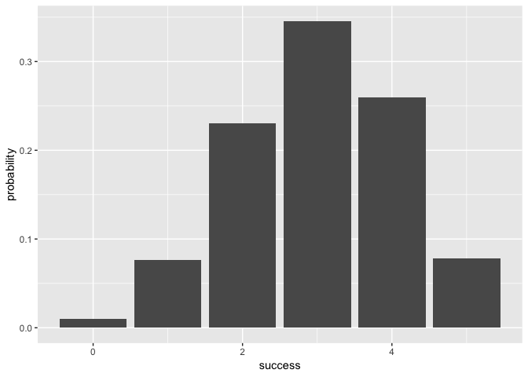
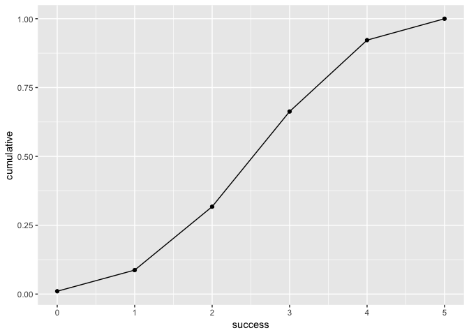

Overview
--------

"binomial" is a minimal \[R\] (<http://www.r-project.org/>) package that provides functions to compute summary measures of binomial distribution and plot the binomial probability distribution. - `bin_variable()` creates a binomial object (of class `"binvar"`). -`summary()` outputs summary description of a binomial object. - `plot` outputs a plot for either cumulative or probability distribution depending on what the input is.

Motivation
----------

This package has been created to help understand what the process is in making an R package.

Installation
------------

To install the package, you have to install a Github version from the package `"devtools"`:

``` r
#Install Github version
#install.packages("devtools")
#Install "binomial" without vignettes 
devtools::install_github("stat133-sp19/hw-stat133-sonia1216/binomial")
#> Skipping install of 'binomial' from a github remote, the SHA1 (cdaa5291) has not changed since last install.
#>   Use `force = TRUE` to force installation
#Install "binomial" with vignettes 
devtools::install_github("stat133-sp19/hw-stat133-sonia1216/binomial", build_vignettes=TRUE)
#> Skipping install of 'binomial' from a github remote, the SHA1 (cdaa5291) has not changed since last install.
#>   Use `force = TRUE` to force installation
```

Usage
-----

``` r
library(binomial)
# create binomial object
binomial_object<-bin_variable(5, 0.6)
#summary of binomial object
summary(binomial_object)
#> "Summary Binomial"
#> 
#> Parameters
#> -number of trials: 5
#> -prob of success: 0.6
#> 
#>  Measures
#> - mean    : 3
#> - variance: 1.2
#> - mode    : 3
#> - skewness: -0.1825742
#> - kurtosis: -0.3666667
```

``` r
#table of binomial probability distribution
bin_distribution(5, 0.6)
#>   success probability
#> 1       0     0.01024
#> 2       1     0.07680
#> 3       2     0.23040
#> 4       3     0.34560
#> 5       4     0.25920
#> 6       5     0.07776
```

``` r
#table of binomial cumulative distribution
bin_cumulative(5, 0.6)
#>   success probability cumulative
#> 1       0     0.01024    0.01024
#> 2       1     0.07680    0.08704
#> 3       2     0.23040    0.31744
#> 4       3     0.34560    0.66304
#> 5       4     0.25920    0.92224
#> 6       5     0.07776    1.00000
```

``` r
#plot of binomial probability distribution
plot(bin_distribution(5, 0.6))
#> 
#> Attaching package: 'dplyr'
#> The following objects are masked from 'package:stats':
#> 
#>     filter, lag
#> The following objects are masked from 'package:base':
#> 
#>     intersect, setdiff, setequal, union
#> Warning: Ignoring unknown parameters: binwidth, bins, pad
```




``` r
#plot of binomial cumulative distribution
plot(bin_cumulative(5,0.6))
```



